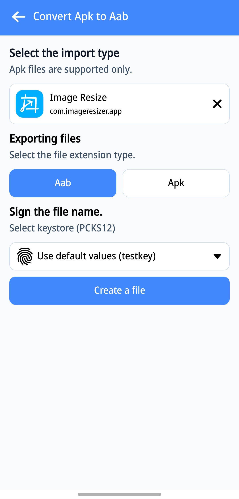
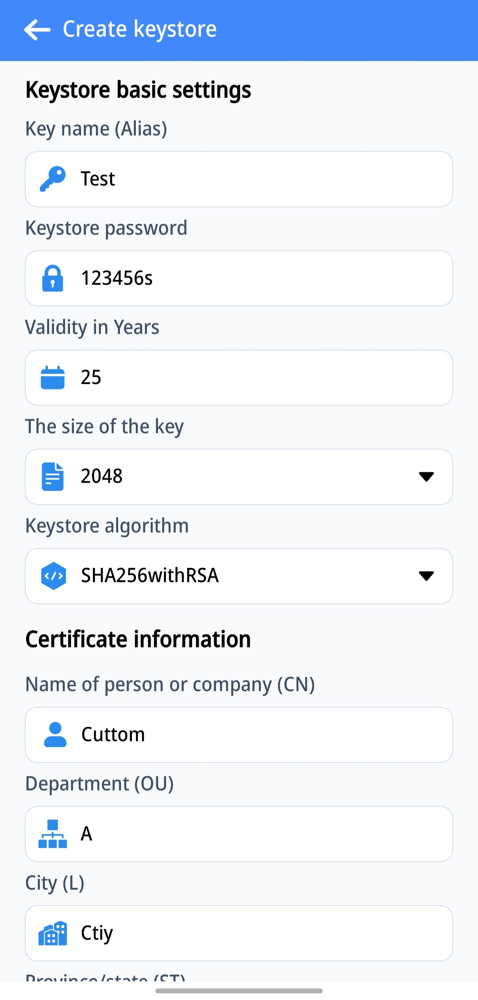
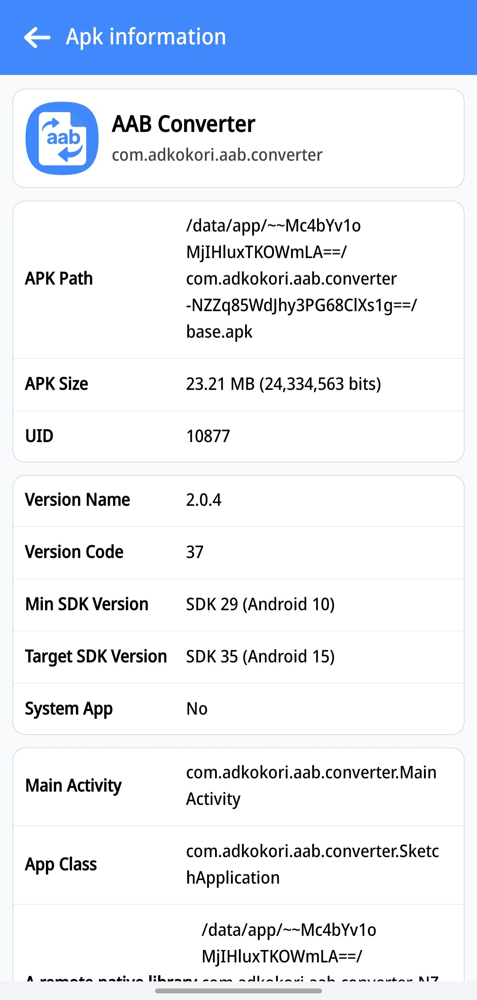

# 🧩 Apk to Aab Converter & Sign

> Convert **APK → AAB** and sign your apps professionally  
> Easy to use, fast, and supports multiple signing schemes (V1–V4) within seconds.

---

## 🚀 About the App

**Apk to Aab Converter & Sign** is a professional tool for Android developers  
that allows you to convert `.apk` files to `.aab` bundles and sign them securely.  
No need for Android Studio — just a few taps, and your app is ready for **Google Play Console**.

🔒 The source code of this app is **Closed Source (Commercial)**  
to protect premium features and prevent unauthorized access.

---

## ✨ Highlights

| Category | Description |
|------|-------------|
| 🔐 Signing System | Supports V1, V2, V3, and V4 signing via official Android `ApkSigner` API |
| ⚙️ Compatibility | Works reliably on Android 10 and above |
| 💡 High Performance | Processes conversions within seconds with real-time status updates |
| 🧭 Security | No data is uploaded externally — all operations run offline on the user's device |

---

## ⚙️ Basic Features

| Feature | Description |
|------|-------------|
| 🔄 File Conversion | Convert APK to Android App Bundle (.aab) with precision |
| 📥 File Import | Import `.apk` files from your device or extract APKs from pre-installed apps (Premium users only) |
| 📂 Custom Keystore Import (.p12) | Import your own `.p12` keystore directly from your device |

---

## 💎 Premium Features

| Feature | Description |
|------|-------------|
| 🔐 Create Custom Keystore | Generate and fully customize your own keystore directly in the app |
| 🔎 Manage Keystores on Device | Delete or organize keystores saved on your device |
| 💾 Save Keystore | Automatically stores newly detected keystores for quick use next time |
| 📄 Read APK Metadata | Extract detailed information from `.apk` files for analysis |
| 📥 Import APK | Import `.apk` files by extracting from pre-installed apps |
| 📤 Export | Export files as either `.apk` or `.aab` |

---

## 🧠 Why Choose Apk to Aab Converter & Sign

- ✅ No need for Android Studio or Gradle commands  
- ✅ Convert and sign files in one app  
- ✅ Designed for both individual developers and studios  
- ✅ Lightweight, powerful, and incredibly fast  

---

## 📱 Screenshots

| File Conversion | Create Keystore | APK Metadata |
|:--:|:--:|:--:|
|  |  |  |

> *UI images are illustrative. Actual interface may vary depending on the version.*

---

## 🔽 Download

| Type | Link |
|---------|----------------|
| 📦 Google Playstore | [Visit Google Playstore](https://play.google.com/store/apps/details?id=com.adkokori.aab.converter) |

---

## 🧩 Security & Privacy

- No user data or signing keys are ever uploaded to servers  
- All processing is performed locally on your device  
- AES encryption is used to secure locally stored keys  

📜 [Read Privacy Policy](https://adkokori.online/AABConverter/PrivacyPolicy.html)

---

## 🛠️ Support

- **Report Issues:** [mychakkri@gmail.com](mailto:mychakkri@gmail.com)  

---

## 🧾 License

This software is distributed under a **Commercial Proprietary License**.  
Copying, modifying, or redistributing the source code is strictly prohibited.

© 2025 Apk to Aab Converter & Sign — All Rights Reserved.

---

## ❤️ Thank You for Supporting Developers

> “Just one tap — convert and sign your apps professionally.”  
> — Apk to Aab Converter & Sign Team
